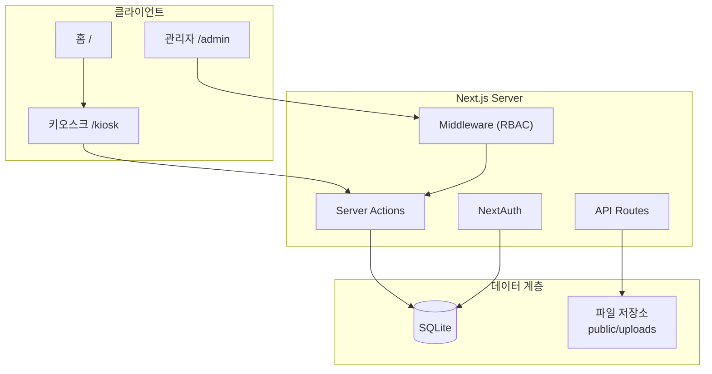

# 쌍청문 키오스크 (Ramen Kiosk)

> 청소년 센터 물품 대여를 위한 셀프서비스 키오스크 & 관리자 대시보드

종이 수기 대장으로 운영되던 라면·물품 대여 프로세스를 디지털 키오스크로 전환한 풀스택 웹 애플리케이션입니다.  
청소년이 직접 물품을 대여하고, 관리자는 재고·대여 기록·이용 통계를 실시간으로 관리할 수 있습니다.

---

## 목차

- [프로젝트 개요](#프로젝트-개요)
- [주요 기능](#주요-기능)
- [스크린샷](#스크린샷)
- [기술 스택](#기술-스택)
- [시스템 구조](#시스템-구조)
- [시작하기](#시작하기)
- [환경 변수](#환경-변수)
- [Docker 배포](#docker-배포)
- [프로젝트 구조](#프로젝트-구조)

---

## 프로젝트 개요

| 항목 | 내용 |
|------|------|
| **배경** | 청소년 센터(쌍청문)에서 라면, 닌텐도, 보드게임 등 물품 대여를 수기 장부로 관리 |
| **문제** | 기록 누락, 재고 파악 불가, 이용 패턴 분석 불가, 관리자 업무 부담 |
| **해결** | 터치 키오스크 + 관리자 대시보드로 대여·반납·통계를 자동화 |
| **대상 사용자** | 청소년(키오스크 이용자), 센터 직원·인턴(관리자) |

---

## 주요 기능

### 키오스크 (`/kiosk`)

- 카테고리별 물품 목록 조회 (라면, 닌텐도, 보드게임 등)
- 이름·전화번호 기반 간편 대여 (회원가입 불필요)
- **시간제 대여** — 닌텐도 등 인기 물품의 이용 시간·횟수 제한
- **대기열** — 시간제 물품 이용 중일 때 순번 대기
- **무활동 홍보물 슬라이드** — 이미지·동영상·PDF·YouTube URL 자동 재생
- PWA 지원 — 키오스크 단말에 앱처럼 설치 가능

### 관리자 패널 (`/admin`)

- **대시보드** — 대여 통계, 연령·카테고리별 분석 차트 (Recharts)
- **물품 관리** — CRUD, 드래그 정렬, 자동 숨김 스케줄, 시간제 설정
- **사용자 관리** — 일반 이용자·관리자 계정 관리
- **대여 기록** — 필터·검색·Excel 내보내기
- **대기열 관리** — 현재 이용 현황 및 대기 목록 실시간 확인
- **프로모션** — 홍보물 파일·외부 URL 업로드
- **약관·동의서** — 개인정보 수집 동의서 PDF/이미지 관리
- **새학기 설정** — 학교 정보 재확인 모드, 데이터 백업

### 인증 & 보안

- NextAuth 기반 세션 관리
- bcrypt 비밀번호 해싱
- RBAC — `USER` / `ADMIN` 역할 기반 접근 제어
- Middleware를 통한 관리자 라우트 보호

---

## 스크린샷

> 아래 이미지는 실제 키오스크·관리자 화면 캡처입니다.

| 홈 화면 | 키오스크 |
|:---:|:---:|
|  |  |

| 대여 다이얼로그 | 관리자 대시보드 |
|:---:|:---:|
|  |  |

---

## 기술 스택

### Frontend

| 기술 | 용도 |
|------|------|
| **Next.js 15** (App Router) | SSR, Server Actions, 라우팅 |
| **React 19** | UI 컴포넌트 |
| **TypeScript** | 타입 안전성 |
| **Tailwind CSS 4** | 스타일링 |
| **shadcn/ui + Radix UI** | UI 컴포넌트 라이브러리 |
| **React Hook Form + Zod** | 폼 검증 |
| **TanStack Table** | 데이터 테이블 |
| **Recharts** | 통계 차트 |
| **next-pwa** | PWA 지원 |

### Backend

| 기술 | 용도 |
|------|------|
| **Next.js Server Actions** | 서버 로직 |
| **NextAuth.js** | 인증 |
| **Drizzle ORM** | DB 쿼리·마이그레이션 |
| **SQLite** (better-sqlite3) | 로컬 DB |
| **bcrypt** | 비밀번호 해싱 |
| **ExcelJS** | Excel 내보내기 |

### DevOps

| 기술 | 용도 |
|------|------|
| **Docker + Docker Compose** | 컨테이너 배포 |
| **Next.js Standalone Output** | 경량 프로덕션 빌드 |

---

## 시스템 구조



### 데이터 모델 (핵심 테이블)

| 테이블 | 설명 |
|--------|------|
| `items` | 대여 물품 (카테고리, 시간제 설정, 자동 숨김) |
| `general_users` | 일반 이용자 (이름, 전화번호, 학교) |
| `users` | 관리자 계정 |
| `rental_records` | 대여 기록 |
| `waiting_entries` | 시간제 물품 대기열 |
| `item_auto_hide_schedules` | 요일·시간별 물품 자동 숨김 |

---

## 시작하기

### 사전 요구사항

- Node.js 20+
- npm

### 로컬 개발

```bash
# 1. 의존성 설치
npm install

# 2. 환경 변수 설정 (아래 참고)
cp .env.example .env.local   # 또는 직접 생성

# 3. 데이터베이스 초기화
npm run db:push

# 4. 개발 서버 실행
npm run dev
```

브라우저에서 [http://localhost:3000](http://localhost:3000) 접속

| 경로 | 설명 |
|------|------|
| `/` | 홈 (홍보물 슬라이드) |
| `/kiosk` | 키오스크 대여 화면 |
| `/admin` | 관리자 대시보드 |
| `/login` | 관리자 로그인 |

### DB 관련 스크립트

```bash
npm run db:push      # 스키마를 DB에 반영
npm run db:generate  # 마이그레이션 파일 생성
npm run db:migrate   # 마이그레이션 실행
npm run db:studio    # Drizzle Studio GUI
npm run db:reset     # DB 초기화 (주의: 데이터 삭제)
```

---

## 환경 변수

프로젝트 루트에 `.env.local`(개발) 또는 `.env`(Docker) 파일을 생성합니다.

```env
# NextAuth
NEXTAUTH_URL=http://localhost:3000
NEXTAUTH_SECRET=your-secret-key-here

# Database (선택, 기본값: ./data/local.db)
DATABASE_URL=local.db
```

> `NEXTAUTH_SECRET`은 `openssl rand -base64 32` 등으로 생성하세요.

---

## Docker 배포

```bash
# 1. .env 파일에 NEXTAUTH_SECRET 설정

# 2. 빌드 & 실행
docker compose up -d --build

# 3. 접속
# http://localhost:3000
```

Docker Compose는 다음 볼륨을 사용해 데이터를 영속화합니다.

- `app-data` — SQLite DB (`/app/data`)
- `uploads-data` — 업로드 파일 (`/app/public/uploads`)

---

## 프로젝트 구조

```
ramen-kiosk/
├── src/
│   ├── app/
│   │   ├── (kiosk)/kiosk/     # 키오스크 화면
│   │   ├── (admin)/admin/     # 관리자 패널
│   │   ├── (auth)/            # 로그인·회원가입
│   │   └── api/               # API Routes
│   ├── components/
│   │   ├── ui/                # shadcn/ui 컴포넌트
│   │   └── item/              # 대여 관련 컴포넌트
│   └── lib/
│       ├── actions/           # Server Actions
│       ├── db/                # Drizzle DB 연결
│       └── validators/        # Zod 스키마
├── drizzle/                   # DB 스키마·마이그레이션
├── public/uploads/            # 업로드 파일
├── docker-compose.yml
└── Dockerfile
```

---

## 라이선스

이 프로젝트는 포트폴리오 목적으로 공개되었습니다.  
상업적 이용 및 재배포 시 사전 문의 바랍니다.
